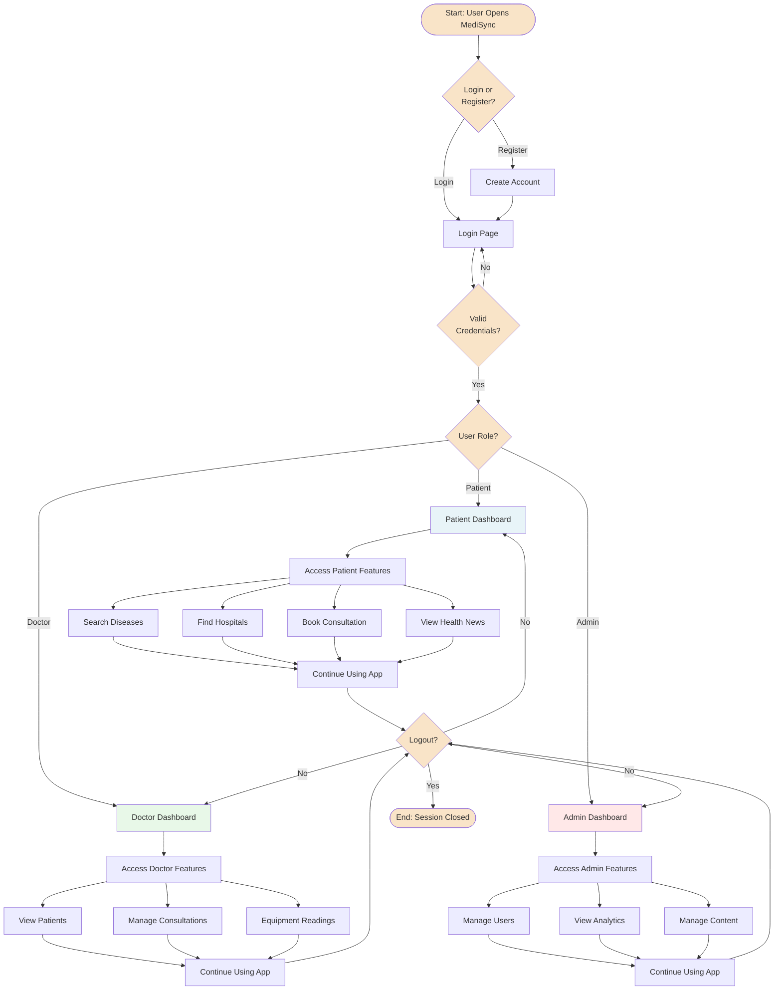
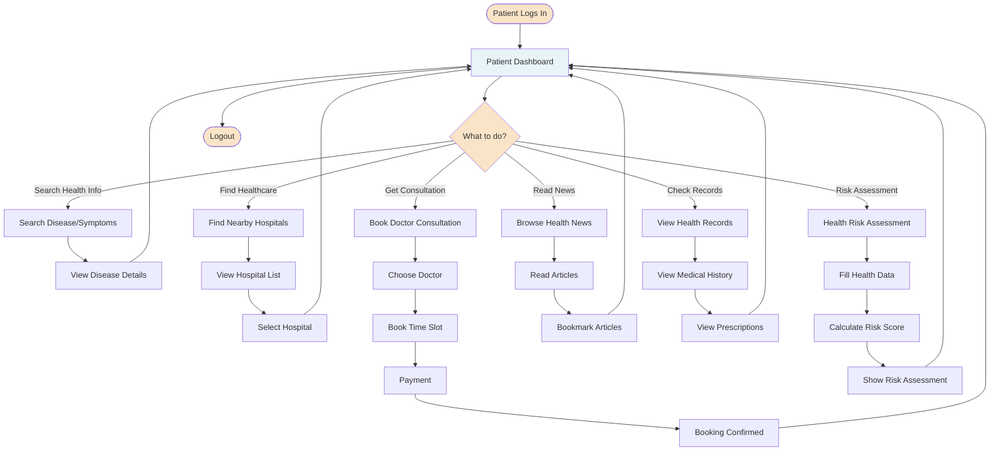
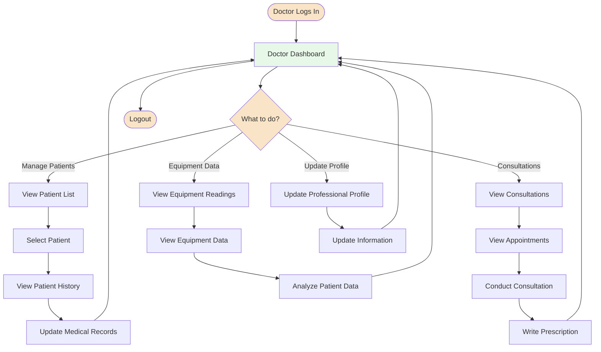
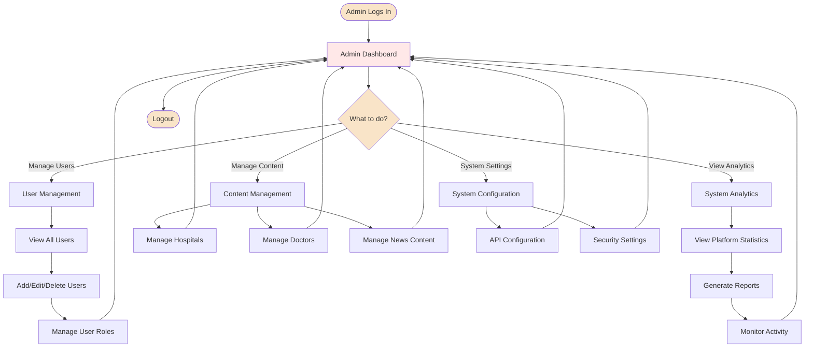
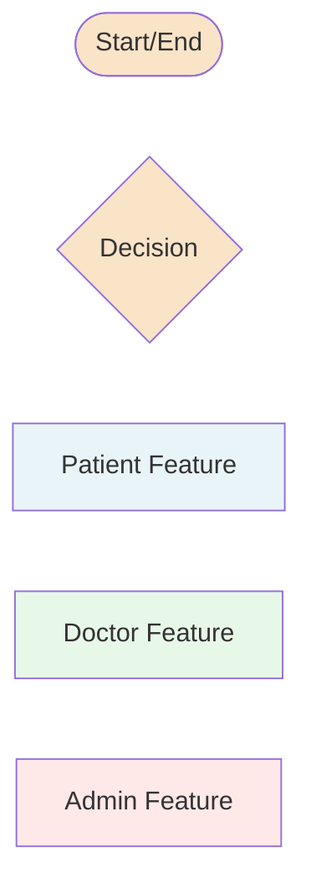

# MediSync Healthcare Platform - Flow Diagram

## Main Application Flow

---

## Detailed Patient Journey

---

## Detailed Doctor Journey

---

## Detailed Admin Journey

---

## How to View This Diagram

### Option 1: VS Code Preview
1. Open this file in VS Code
2. Install "Markdown Preview Mermaid Support" extension (if not installed)
3. Right-click and select "Open Preview" or press `Ctrl+Shift+V`

### Option 2: Online Viewer
1. Copy any diagram code (including the \`\`\`mermaid ... \`\`\` block)
2. Go to https://mermaid.live
3. Paste the code to see the rendered diagram
4. Export as PNG or SVG for your report

### Option 3: GitHub/GitLab
1. Push this file to your repository
2. Open it on GitHub - Mermaid diagrams render automatically

---

## Legend

- **Rounded Rectangles (Beige)**: Start/End points, Decision points
- **Blue Boxes**: Patient-related features
- **Green Boxes**: Doctor-related features  
- **Red Boxes**: Admin-related features
- **Diamond Shapes**: Decision/Choice points
- **Arrows**: Flow direction

---

## Color Coding Guide

