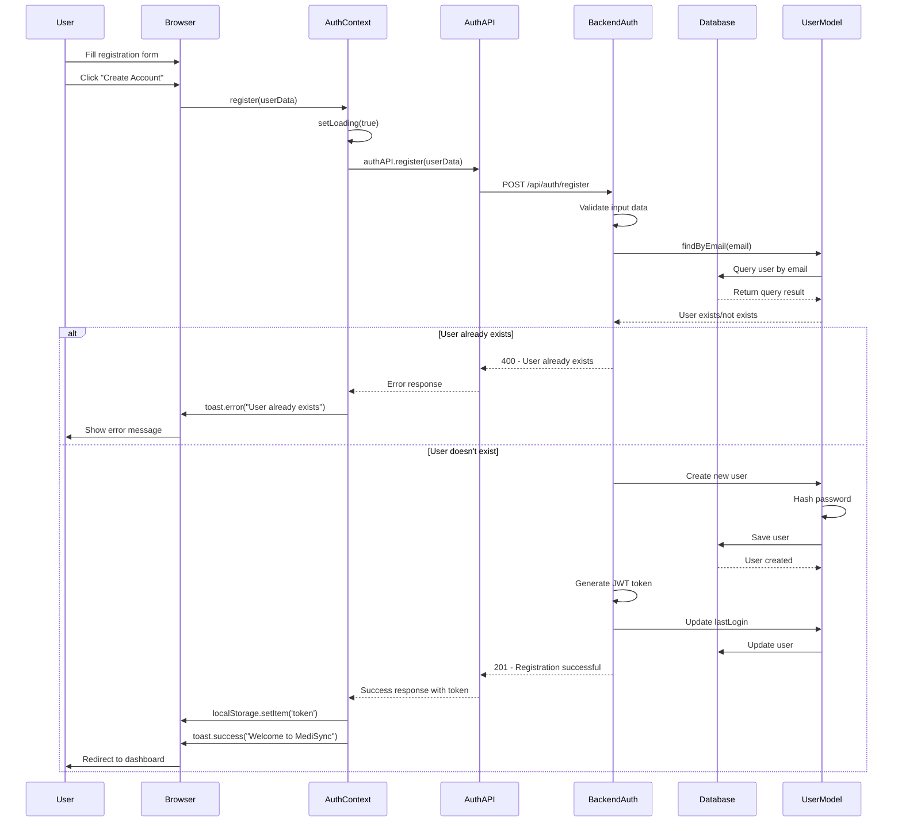
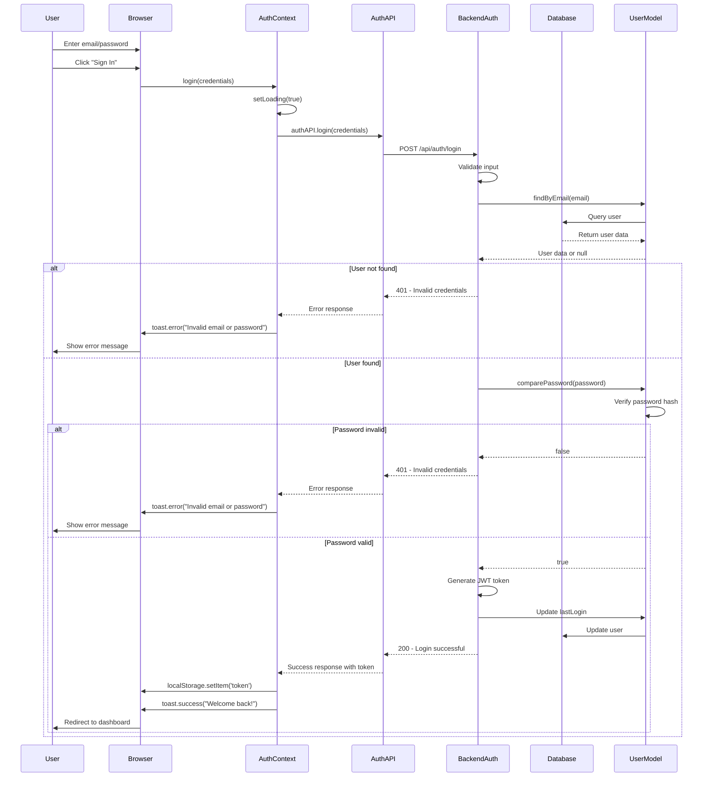
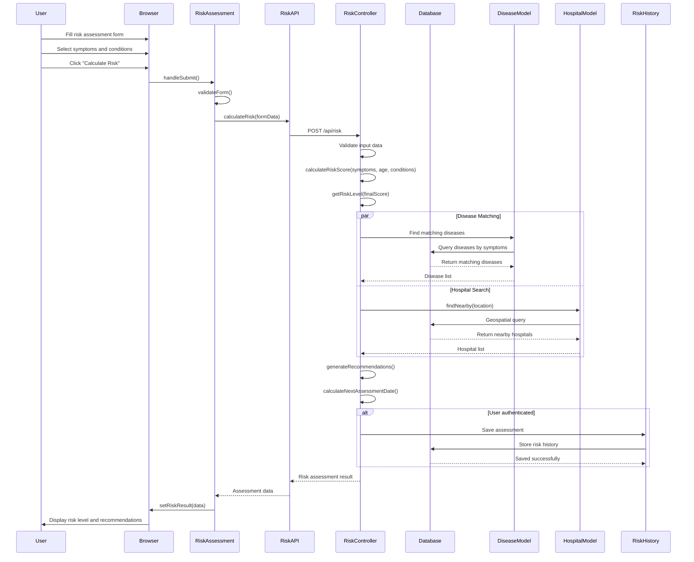
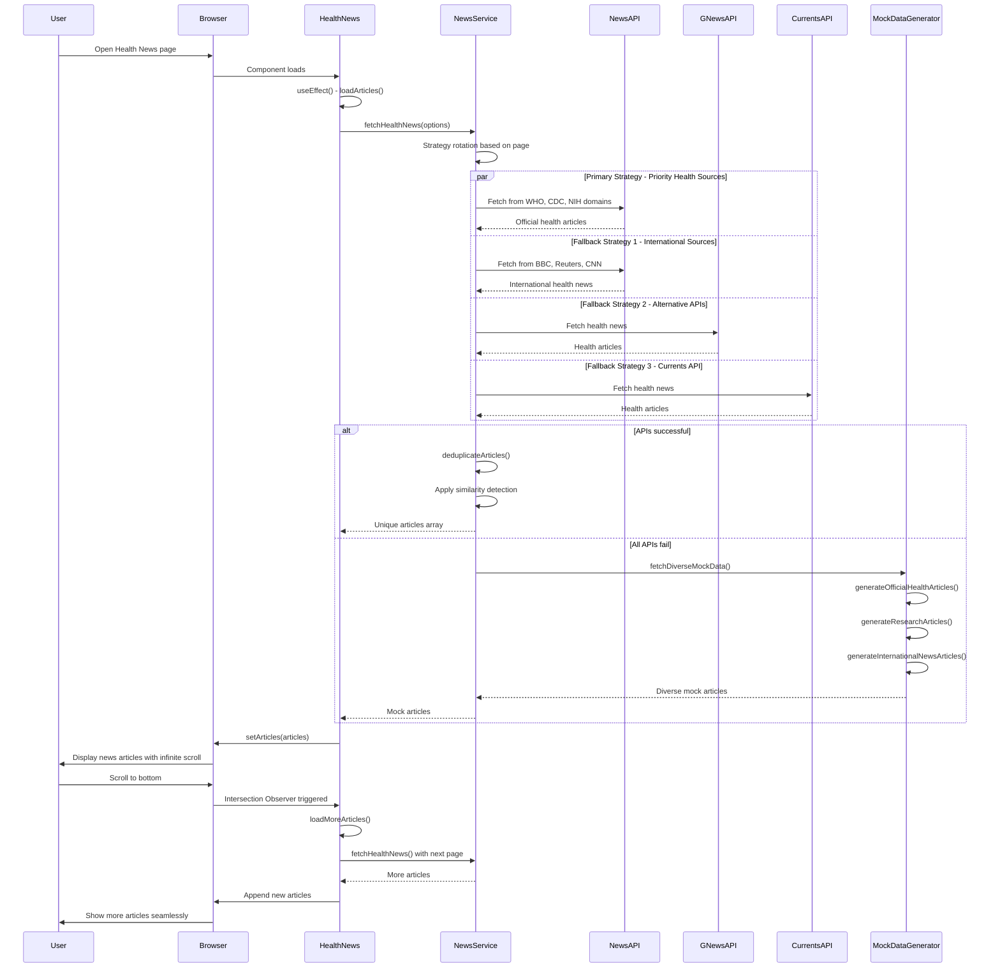
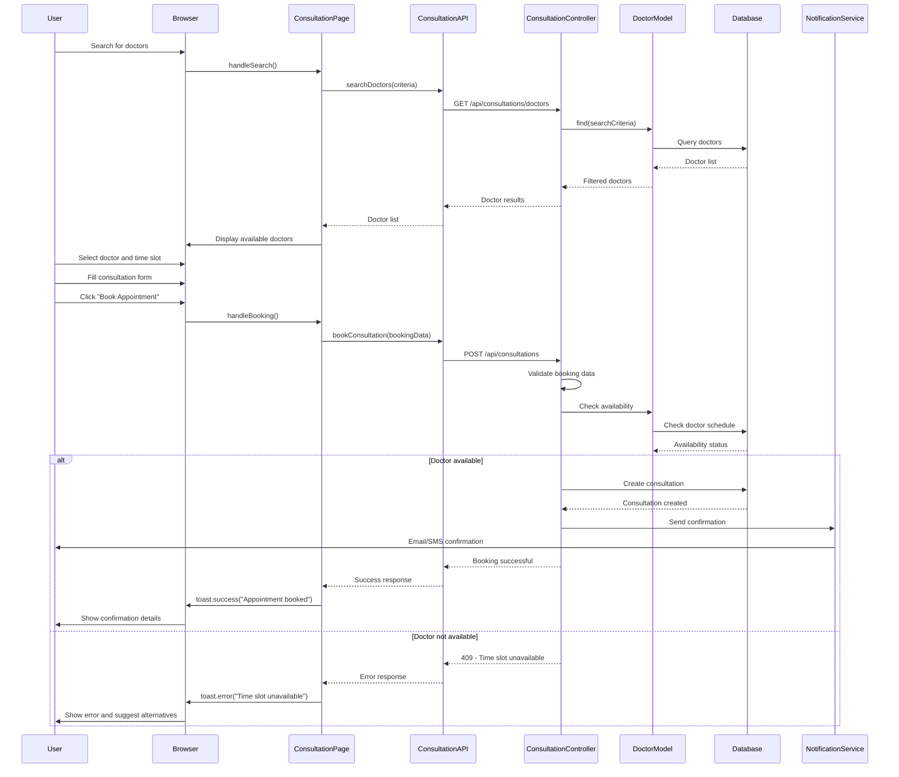
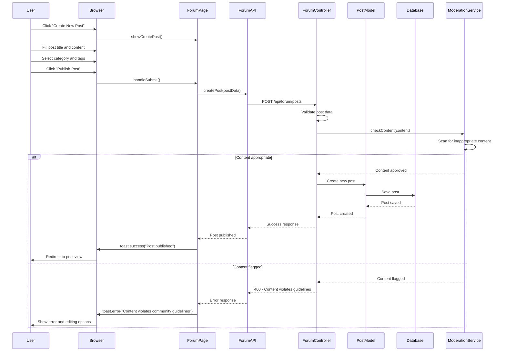
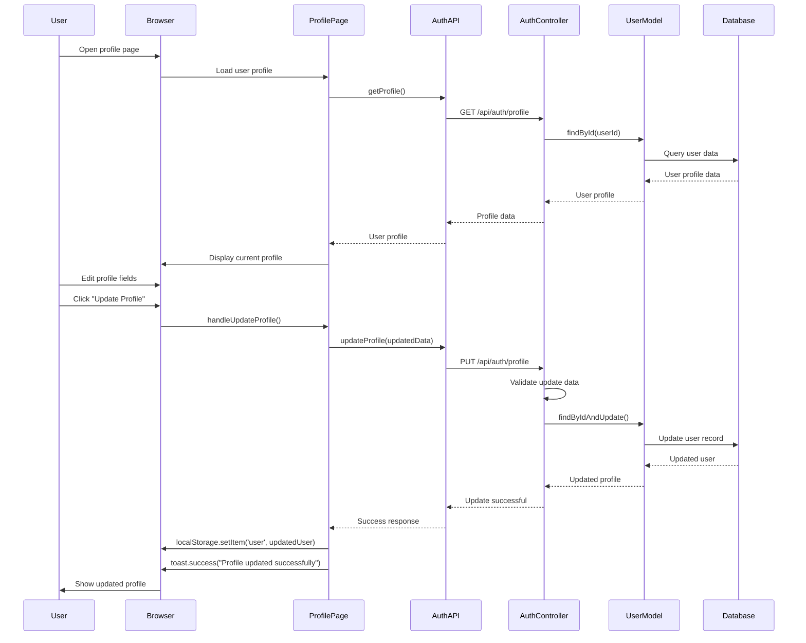
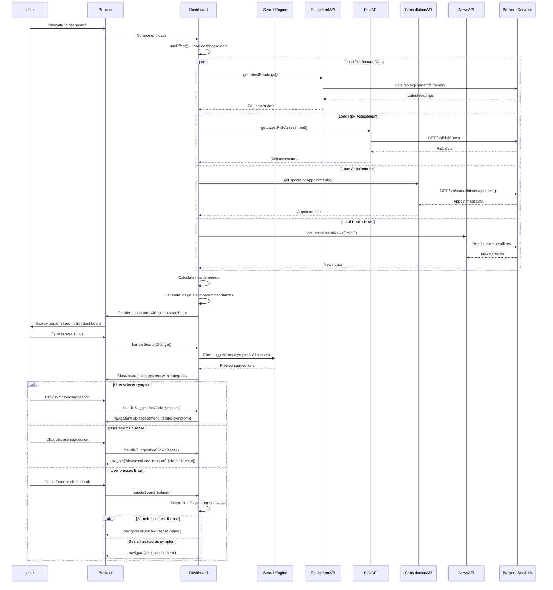
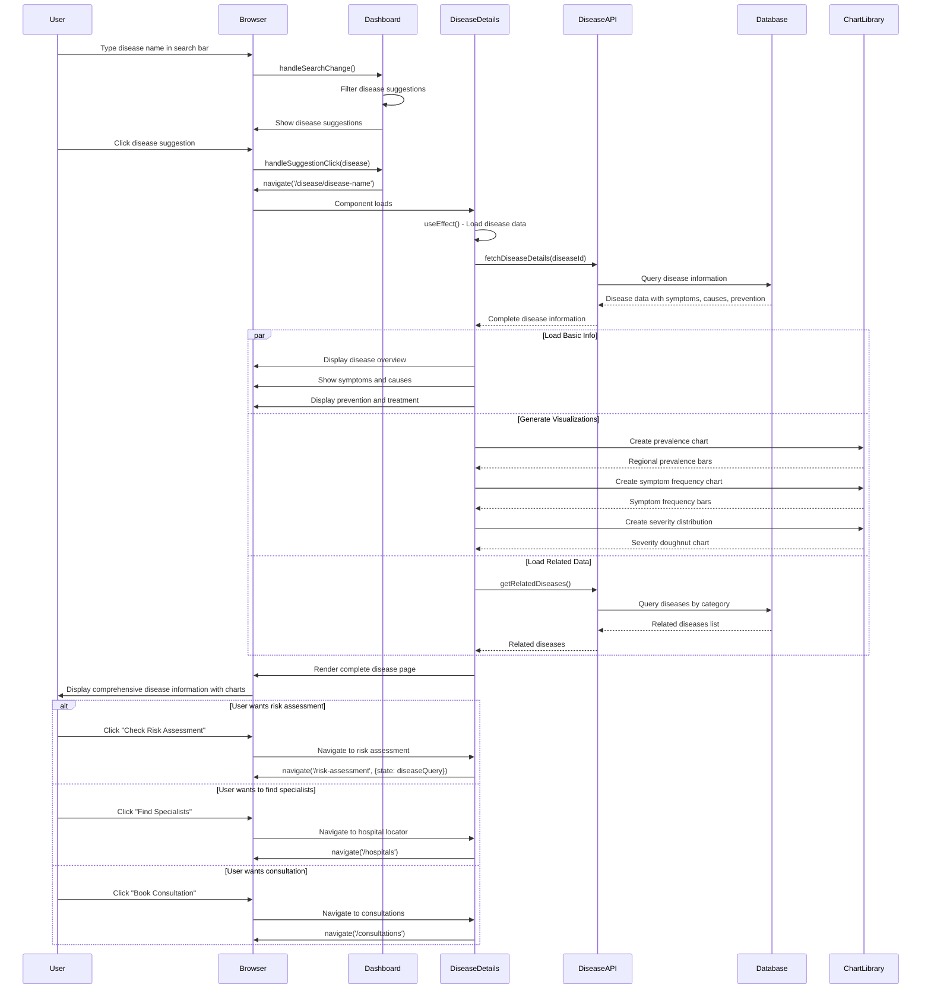

# MediSync Project - Sequence Diagrams

## Overview
This document contains comprehensive sequence diagrams for the MediSync healthcare application, illustrating the interactions between users, frontend, backend, and external services for various use cases.

---

## 1. User Registration Sequence Diagram



---

## 2. User Login Sequence Diagram



---

## 3. Risk Assessment Sequence Diagram



---

## 4. Equipment Reading Submission Sequence Diagram

```mermaid
sequenceDiagram
    participant User
    participant Browser
    participant EquipmentPage
    participant EquipmentAPI
    participant EquipmentController
    participant EquipmentModel
    parameter Database

    User->>Browser: Select equipment type
    User->>Browser: Enter readings (BP, temperature, etc.)
    User->>Browser: Click "Submit Reading"
    
    Browser->>EquipmentPage: handleSubmit()
    EquipmentPage->>EquipmentPage: validateReadings()
    EquipmentPage->>EquipmentAPI: submitReading(readingData)
    EquipmentAPI->>EquipmentController: POST /api/equipment/readings
    
    EquipmentController->>EquipmentController: Validate reading data
    EquipmentController->>EquipmentModel: Create new reading
    
    EquipmentModel->>EquipmentModel: Pre-save middleware
    EquipmentModel->>EquipmentModel: interpretReading(type, readings)
    
    alt Blood Pressure Reading
        EquipmentModel->>EquipmentModel: Check systolic/diastolic values
        EquipmentModel->>EquipmentModel: Determine risk level
    else Temperature Reading
        EquipmentModel->>EquipmentModel: Check fever ranges
        EquipmentModel->>EquipmentModel: Generate alerts if abnormal
    else Other Equipment Types
        EquipmentModel->>EquipmentModel: Apply specific interpretation logic
    end
    
    EquipmentModel->>EquipmentModel: generateAlert() if abnormal
    EquipmentModel->>Database: Save reading with interpretation
    Database-->>EquipmentModel: Reading saved successfully
    
    EquipmentModel-->>EquipmentController: Reading with interpretation
    EquipmentController-->>EquipmentAPI: Success response
    EquipmentAPI-->>EquipmentPage: Reading submitted
    EquipmentPage->>Browser: toast.success("Reading saved")
    Browser->>User: Show success message and interpretation
```

---

## 5. Hospital Locator Sequence Diagram

```mermaid
sequenceDiagram
    participant User
    participant Browser
    parameter HospitalLocator
    participant GeolocationAPI
    participant GoogleMapsAPI
    participant HospitalAPI
    participant OpenStreetMap
    participant Database

    User->>Browser: Open Hospital Locator
    User->>Browser: Click "Get Current Location"
    
    Browser->>HospitalLocator: getCurrentLocation()
    HospitalLocator->>GeolocationAPI: navigator.geolocation.getCurrentPosition()
    GeolocationAPI-->>HospitalLocator: Position coordinates
    
    HospitalLocator->>HospitalLocator: setUserLocation(coordinates)
    HospitalLocator->>HospitalLocator: searchHospitals(location)
    
    par Real Hospital Data
        HospitalLocator->>OpenStreetMap: fetchHospitalsFromMaps()
        OpenStreetMap-->>HospitalLocator: Hospital data
    and Fallback Data
        HospitalLocator->>HospitalAPI: searchHospitals()
        HospitalAPI->>Database: Geospatial query
        Database-->>HospitalAPI: Nearby hospitals
        HospitalAPI-->>HospitalLocator: Hospital list
    end
    
    HospitalLocator->>HospitalLocator: calculateDistance() for each hospital
    HospitalLocator->>HospitalLocator: sortByDistance()
    HospitalLocator->>Browser: Display hospitals on map and list
    
    User->>Browser: Search specific hospital/place
    Browser->>HospitalLocator: handleHospitalSearchChange()
    HospitalLocator->>HospitalLocator: debouncedHybridSearch()
    HospitalLocator->>Browser: Show autocomplete suggestions
    
    User->>Browser: Click "Get Directions"
    Browser->>HospitalLocator: getDirections(hospital)
    HospitalLocator->>GoogleMapsAPI: Open directions URL
    GoogleMapsAPI-->>User: Navigate to Google Maps with directions
```

---

## 6. Health News Loading Sequence Diagram



---

## 7. Doctor Consultation Booking Sequence Diagram



---

## 8. Community Forum Post Creation Sequence Diagram



---

## 9. User Profile Update Sequence Diagram



---

## 10. Dashboard Data Loading Sequence Diagram



---

## 11. Disease Search and Details Sequence Diagram



---

## Key Components and Their Roles

### Frontend Components
- **AuthContext**: Manages authentication state and user sessions
- **Protected Routes**: Ensures authenticated access to protected pages
- **Page Components**: Handle user interactions and API calls
- **API Utilities**: Centralized API communication layer
- **Search Engine**: Smart search with symptom/disease categorization
- **DiseaseDetails**: Comprehensive disease information with data visualizations
- **Chart Components**: Interactive data visualization using Chart.js

### Backend Services
- **Controllers**: Handle HTTP requests and business logic
- **Models**: Database schemas and data validation
- **Middleware**: Authentication, validation, and error handling
- **Routes**: API endpoint definitions and validation rules

### External Services
- **Geolocation API**: User location services
- **Google Maps API**: Directions and place search
- **News APIs**: Real-time health news aggregation
- **OpenStreetMap**: Hospital location data

### Database Operations
- **User Management**: Registration, authentication, profile updates
- **Health Data**: Risk assessments, equipment readings, consultations
- **Content Management**: Forum posts, news articles, hospital data

---

These sequence diagrams provide a comprehensive view of how different actors interact within the MediSync system, showing the flow of data and control through various layers of the application architecture.